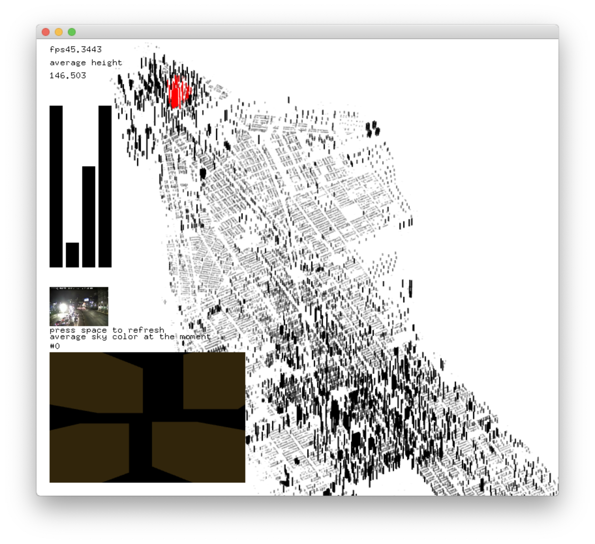

# manhattan_sky
This project is about visualizing how the sky might looks like in different neighborhoods of Manhattan.

___

# Use
This project is compatible with of_v20180924_osx_nightly or later. Get the nightly build here: https://openframeworks.cc/ci_server/versions/nightly/of_v20180924_osx_nightly.zip

Tested on MacOS Mojave.

1. Make sure to get ofxJson from https://github.com/jeffcrouse/ofxJSON

2. Clone the project to the `myApps` folder that comes with oF. (usually there should be a emptyExample in there)

3. Open `manhattan_sky.xcodeproj` in XCode

4. Run the project. Hit space to preview sky.

 
